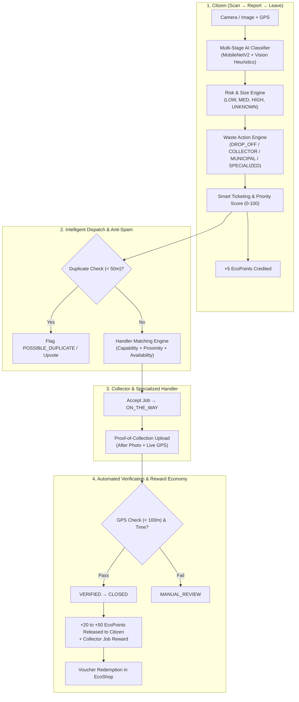

# EcoLoop AI: MVP Implementation Plan (All 10 Core Features)

Build the complete **EcoLoop AI** prototype centered around **AI Waste Triage + Intelligent Handoff (Scan → Report → Leave)** with full Frontend and Backend integration using an SQLite database.

---

## User Review Required

> [!IMPORTANT]
> - **Unified Application Architecture**: The backend will be powered by Flask + SQLite (`ecoloop.db`) + `Flask-JWT-Extended` + `Flask-SQLAlchemy` + PyTorch/Torchvision MobileNetV2 with intelligent heuristic fallbacks.
> - **Rich Glassmorphic Single-Page App**: The frontend will be served directly by Flask as an interactive, state-of-the-art dashboard that seamlessly supports all 5 user roles (`CITIZEN`, `COLLECTOR`, `MUNICIPAL_OFFICER`, `SPECIALIZED_HANDLER`, `ADMIN`) with instant role switching, camera capture, live map, dispatch workflow, proof upload, and reward store.
> - **Seeded Demo Data**: The system will automatically seed demo users, active tickets across various risk categories, local scrap hubs, and reward vouchers on first launch so all workflows can be tested immediately.

---

## 10 Core Features Architecture & Mapping



---

## Proposed Changes

### Backend Components (`ecoloop-backend`)

#### [MODIFY] [config.py](file:///d:/LocalAI/econetwork/ecoloop-backend/config.py)
- Configure JWT secrets, database path (`sqlite:///ecoloop.db`), upload directory, token expiration, CORS settings.

#### [MODIFY] [models/__init__.py](file:///d:/LocalAI/econetwork/ecoloop-backend/models/__init__.py)
- Define complete database schemas:
  - `User`: JWT authentication, hashed passwords, roles (`CITIZEN`, `COLLECTOR`, `MUNICIPAL_OFFICER`, `SPECIALIZED_HANDLER`, `ADMIN`), phone, coordinates, certifications.
  - `WasteIncident`: Full lifecycle fields (`ticket_number`, `image_url`, `latitude`, `longitude`, `waste_category`, `confidence`, `visibility`, `risk_level`, `estimated_size`, `recommended_action`, `safety_instruction`, `priority_score`, `status`, `assigned_handler_id`, `proof_image_url`, `proof_latitude`, `proof_longitude`, `proof_notes`, `verification_status`, `duplicate_of_ticket_id`, `upvotes_count`, timestamps).
  - `Handler`: Associated user, type, capabilities (hazardous, e-waste, scrap), availability flag, active job count, location coordinates.
  - `Wallet`: Points balance, lifetime points, kg CO2 saved, kg waste diverted.
  - `RewardTransaction`: Audit ledger for point credits/debits linked to ticket events.
  - `RewardCoupon`: Catalog of redeemable vouchers (Campus cafe, transit discounts, eco-store).
  - `TicketAuditLog`: History of state transitions with timestamp and actor.

#### [NEW] [services/ai_classifier.py](file:///d:/LocalAI/econetwork/ecoloop-backend/services/ai_classifier.py)
- Multi-stage AI Waste Classifier:
  - Classify waste into categories: `plastic`, `metal`, `organic`, `e_waste`, `glass`, `hazardous`, `paper`, `mixed`.
  - Visibility detection: `VISIBLE`, `SEALED` (e.g., tied black bag/box), `MIXED`.
  - Anti-hallucination logic for sealed bags (marks category as uncertain/sealed rather than guessing).

#### [NEW] [services/risk_engine.py](file:///d:/LocalAI/econetwork/ecoloop-backend/services/risk_engine.py)
- Evaluates danger level: `LOW`, `MEDIUM`, `HIGH`, `UNKNOWN`.
- Evaluates estimated size: `SMALL`, `MEDIUM`, `LARGE`.
- Generates safety instructions (e.g. `"DO NOT TOUCH - HAZARDOUS MATERIAL"`, `"DO NOT OPEN - SEALED CONTAINER"`, `"SAFE TO HANDLE"`).

#### [MODIFY] [services/action_engine.py](file:///d:/LocalAI/econetwork/ecoloop-backend/services/action_engine.py)
- Maps Risk + Size + Category + Visibility to deterministic routing actions:
  - Safe + Small = `DROP_OFF` (Direct to nearby scrap/recycling hub)
  - Known Recyclable + Large = `COLLECTOR_PICKUP`
  - Sealed / Mixed / Public Dump = `MUNICIPAL_PICKUP`
  - Hazardous / E-Waste / High Risk = `SPECIALIZED_HANDLER`

#### [NEW] [services/handler_matching.py](file:///d:/LocalAI/econetwork/ecoloop-backend/services/handler_matching.py)
- Geospatial matching based on Haversine distance, handler capabilities (certifications for e-waste/hazardous vs general scrap), and availability.
- Matches and auto-assigns tickets to the nearest qualifying handler.

#### [NEW] [services/verification_engine.py](file:///d:/LocalAI/econetwork/ecoloop-backend/services/verification_engine.py)
- **Collector Verification**: Compares collection proof GPS coordinates against the incident report GPS (checks if distance < 100m) and verifies logical timestamp ordering.
- **Citizen Anti-Spam / Duplicate Detection**: Compares incoming reports against active reports within a 50m radius and 24-hour window; flags `POSSIBLE_DUPLICATE` to prevent reward farming.

#### [NEW] [services/reward_engine.py](file:///d:/LocalAI/econetwork/ecoloop-backend/services/reward_engine.py)
- Transactional wallet management:
  - Credits +5 EcoPoints on initial verified scan report.
  - Credits bulk (+20 to +50 EcoPoints) upon ticket reaching `VERIFIED` closed status.
  - Calculates environmental impact (CO2 footprint avoided, kg diverted).
  - Handles coupon redemption transactions.

#### [NEW] [routes/auth.py](file:///d:/LocalAI/econetwork/ecoloop-backend/routes/auth.py)
- `POST /api/auth/register`, `POST /api/auth/login`, `GET /api/auth/me`, `POST /api/auth/demo-switch` (easy role-switching token generator for testing all 5 personas).

#### [MODIFY] [routes/scan.py](file:///d:/LocalAI/econetwork/ecoloop-backend/routes/scan.py)
- `POST /api/scans`: Upload photo + GPS + timestamp, run duplicate check, trigger AI classifier, risk engine, action engine, priority calculation (0-100), create incident record, award initial report points, trigger handler matching.

#### [NEW] [routes/tickets.py](file:///d:/LocalAI/econetwork/ecoloop-backend/routes/tickets.py)
- `GET /api/tickets`: Role-aware ticket listing (Citizens see their reports; Collectors see matched nearby jobs; Municipal & Admins see full city view).
- `GET /api/tickets/<ticket_number>`: Detailed ticket info, timeline events, and coordinates.
- `POST /api/tickets/<ticket_number>/status`: State machine transitions (`ACCEPTED`, `ON_THE_WAY`, `ARRIVED`).
- `POST /api/tickets/<ticket_number>/proof`: Submit "after" photo + GPS + notes.
- `POST /api/tickets/<ticket_number>/upvote`: Citizen confirmation of duplicate incidents.

#### [NEW] [routes/wallet.py](file:///d:/LocalAI/econetwork/ecoloop-backend/routes/wallet.py)
- `GET /api/wallet`: Current balance, lifetime earnings, carbon metrics.
- `GET /api/wallet/transactions`: History of point earnings and redemptions.
- `GET /api/rewards/catalog`: Available coupons and rewards.
- `POST /api/rewards/redeem`: Redeem coupon code with point deduction.

#### [NEW] [routes/stats.py](file:///d:/LocalAI/econetwork/ecoloop-backend/routes/stats.py)
- `GET /api/stats/dashboard`: Real-time operational metrics for Admin/Municipal dashboards (triage breakdown, risk distribution, closed rate, active tickets).

#### [MODIFY] [routes/map.py](file:///d:/LocalAI/econetwork/ecoloop-backend/routes/map.py)
- `GET /api/map/incidents`: Rich geo-JSON data with risk color coding, scrap hubs, and handler locations.

#### [NEW] [seed_data.py](file:///d:/LocalAI/econetwork/ecoloop-backend/seed_data.py)
- Script to populate the database with default accounts for all 5 roles (`citizen@ecoloop.ai`, `collector@ecoloop.ai`, `municipal@ecoloop.ai`, `specialized@ecoloop.ai`, `admin@ecoloop.ai`), sample tickets, scrap hubs, and reward vouchers.

#### [MODIFY] [app.py](file:///d:/LocalAI/econetwork/ecoloop-backend/app.py)
- Register all blueprints, initialize JWT, setup static file serving for uploads and the frontend single-page app, run automatic DB creation and seed data.

---

### Frontend Components (`ecoloop-backend/templates` & `ecoloop-backend/static`)

#### [NEW] [templates/index.html](file:///d:/LocalAI/econetwork/ecoloop-backend/templates/index.html)
- Modern, dynamic SPA dashboard interface with:
  1. **Top Navigation & Role Switcher**: Instant switching between `Citizen`, `Collector`, `Municipal Officer`, `Specialized Handler`, and `Admin`; live wallet badge.
  2. **Citizen Portal (Scan & Report)**:
     - Drag-and-drop / Camera photo upload with live preview.
     - Live geolocation indicator with manual pin picker.
     - Real-time AI Triage Result display:
       - Category badge with confidence meter
       - Visibility badge (`VISIBLE` / `SEALED` / `MIXED`)
       - Risk Alert (`LOW`, `MEDIUM`, `HIGH`, `UNKNOWN`) with dynamic `"DO NOT TOUCH"` hazard banners
       - Action Engine recommendation card (`DROP_OFF`, `COLLECTOR_PICKUP`, `MUNICIPAL_PICKUP`, `SPECIALIZED_HANDLER`)
       - Priority score meter
     - Citizen Ticket Tracker: Live status progression from `CREATED` to `VERIFIED`.
  3. **Collector & Specialized Handler Portal**:
     - Nearby dispatched jobs with distance, priority badge, and waste type.
     - Job lifecycle action buttons (`Accept Job` → `On The Way` → `Upload Proof`).
     - Proof of Collection Modal: Upload "After" photo + capture GPS + instant Haversine distance verification (< 100m).
  4. **Municipal & Admin Command Center**:
     - Live Leaflet map with interactive color-coded risk markers (`#ef4444` High Risk, `#f97316` Unknown/Sealed, `#22c55e` Low Risk), recycling hubs, and filter chips.
     - Ticket lifecycle Kanban board & priority dispatch overrides.
     - Live city impact counters (Total triaged, kg diverted, CO2 avoided).
  5. **Impact Wallet & Rewards Store**:
     - Live points counter, breakdown of +5 report / +20 collection points.
     - Interactive voucher cards with "Redeem Coupon" modal and voucher code generator.

#### [NEW] [static/css/style.css](file:///d:/LocalAI/econetwork/ecoloop-backend/static/css/style.css)
- Premium dark-mode glassmorphic design system using CSS variables, smooth gradients (`#0f172a`, `#1e293b`, `#10b981`, `#06b6d4`), responsive grids, pulsing risk tags, and micro-animations.

#### [NEW] [static/js/app.js](file:///d:/LocalAI/econetwork/ecoloop-backend/static/js/app.js)
- Frontend client logic: Auth handling, JWT storage, instant role switching, camera capture, API requests to all 10 feature endpoints, Leaflet map rendering, state machine interactions, proof submission, and live notifications.

---

## Verification Plan

### Automated Tests
1. **API & Engine Tests (`test_ecoloop.py`)**:
   - Test Auth & JWT token validation for all 5 roles.
   - Test AI Classification & Visibility handling for both visible items and sealed bags.
   - Test Risk & Size Engine safety instruction generation.
   - Test Action Engine deterministic routing rules.
   - Test Ticket State Machine transitions from `CREATED` to `CLOSED`.
   - Test Handler Matching proximity & capability filtering.
   - Test Proof-of-Collection GPS verification (< 100m vs >= 100m) and Anti-Spam duplicate check (< 50m).
   - Test Reward Engine point allocations (+5 report, +20 verification) and voucher redemption.
   ```bash
   python -m unittest test_ecoloop.py
   ```

### Manual Verification
1. Open the web dashboard in the browser.
2. Test **Citizen Flow**:
   - Upload sample waste image (e.g. plastic bottle or sealed bag).
   - Verify AI categorization, visibility flag, risk level, action engine output, priority score, and +5 points in wallet.
3. Test **Collector / Specialized Handler Flow**:
   - Switch role to Collector / Specialized Handler.
   - View assigned ticket in nearby jobs queue.
   - Transition to `ACCEPTED` and `ON_THE_WAY`.
   - Submit collection proof ("after" photo + GPS) and verify automated verification (< 100m) closes the ticket.
4. Test **Reward Store**:
   - Switch back to Citizen, verify bulk bonus points (+20) credited upon verification.
   - Redeem a reward voucher from the catalog.
5. Test **Municipal Officer & Admin Map**:
   - Open Live Map, toggle risk filters, view city-wide statistics.
